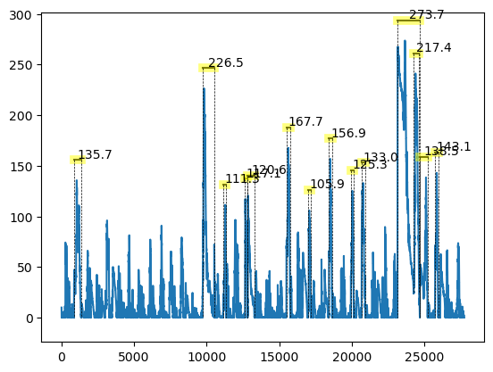
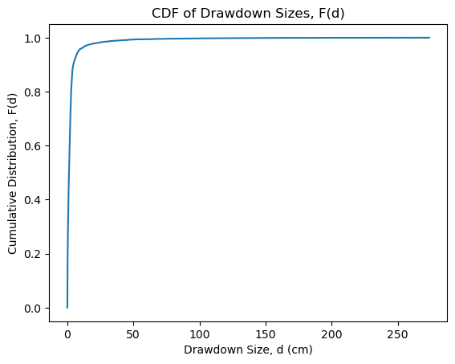

# Drawdown

Find the locations, magnitude, and duration of drawdown events in a time series of Plant Available Water Storage.


```python
from Drawdown import Drawdown, cum_dist
file = 'BoulderS.csv'
drawdown = Drawdown(filename=file, find_drawdowns=True, debug=False)
```

    [2023-01-24 14:09:26,071 Drawdown.py->__init__():65]INFO: There are 5902 total downvals
    [2023-01-24 14:09:26,071 Drawdown.py->__init__():66]INFO: There are 5901 total upvals
    [2023-01-24 14:09:26,072 Drawdown.py->__init__():68]INFO: Cacluating drawdowns...


      0%|          | 0/5900 [00:00<?, ?it/s]


## Drawdown Plot


```python
drawdown.plot(
    threshold=100,
    show_up_locs=False,show_down_locs=False,
    offset=20)
```


    

    


## Drawdown Distribution


```python
from matplotlib import pyplot as plot
x, y = cum_dist(drawdown.df['magnitude'])
plot.plot(x,y)
plot.xlabel('Drawdown Size, d (cm)')
plot.ylabel('Cumulative Distribution, F(d)')
plot.title('CDF of Drawdown Sizes, F(d)')
```


    Text(0.5, 1.0, 'CDF of Drawdown Sizes, F(d)')


    

    


## Drawdown Stats


```python
drawdown.df[['magnitude','duration','filling','draining']].describe()
```


<div>
<style scoped>
    .dataframe tbody tr th:only-of-type {
        vertical-align: middle;
    }

    .dataframe tbody tr th {
        vertical-align: top;
    }

    .dataframe thead th {
        text-align: right;
    }
</style>
<table border="1" class="dataframe">
  <thead>
    <tr style="text-align: right;">
      <th></th>
      <th>magnitude</th>
      <th>duration</th>
      <th>filling</th>
      <th>draining</th>
    </tr>
  </thead>
  <tbody>
    <tr>
      <th>count</th>
      <td>1775.000000</td>
      <td>1775.000000</td>
      <td>1.775000e+03</td>
      <td>1775.000000</td>
    </tr>
    <tr>
      <th>mean</th>
      <td>17.693007</td>
      <td>26.097465</td>
      <td>1.742178e+02</td>
      <td>86.043756</td>
    </tr>
    <tr>
      <th>std</th>
      <td>63.317201</td>
      <td>297.067234</td>
      <td>3.126146e+02</td>
      <td>180.941009</td>
    </tr>
    <tr>
      <th>min</th>
      <td>0.000000</td>
      <td>2.000000</td>
      <td>5.551115e-17</td>
      <td>0.000000</td>
    </tr>
    <tr>
      <th>25%</th>
      <td>1.636735</td>
      <td>2.000000</td>
      <td>5.544403e+00</td>
      <td>2.797929</td>
    </tr>
    <tr>
      <th>50%</th>
      <td>4.429416</td>
      <td>4.000000</td>
      <td>3.232907e+01</td>
      <td>8.130028</td>
    </tr>
    <tr>
      <th>75%</th>
      <td>11.120472</td>
      <td>8.000000</td>
      <td>2.255705e+02</td>
      <td>64.936869</td>
    </tr>
    <tr>
      <th>max</th>
      <td>1027.690402</td>
      <td>8813.000000</td>
      <td>1.999801e+03</td>
      <td>1235.979007</td>
    </tr>
  </tbody>
</table>
</div>


